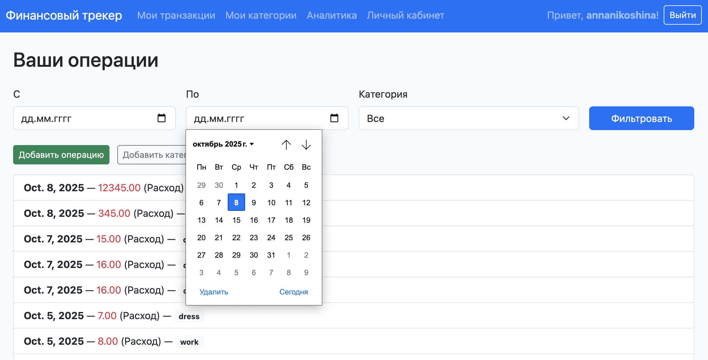
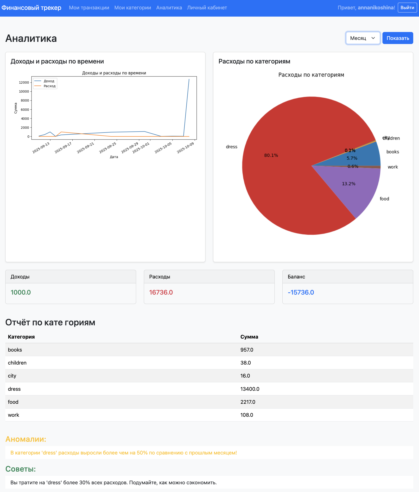
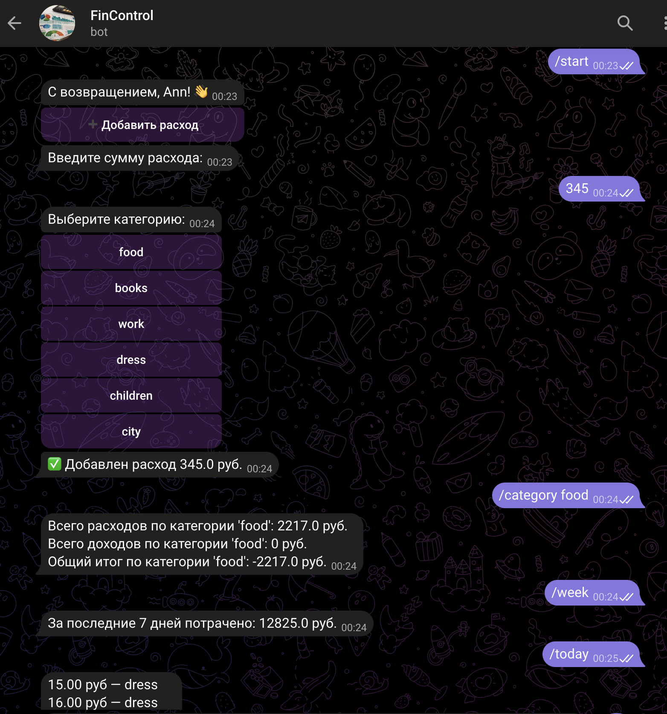

# FinControl

**FinControl** — MVP-сервис учёта личных финансов с веб-интерфейсом, аналитикой и Telegram-ботом.

## О проекте

FinControl — это инструмент для ведения доходов и расходов, визуального анализа финансовой активности, получения персонализированных советов и быстрого взаимодействия через Telegram-бота. Разработан в рамках учебного проекта по техническому заданию стартапа FinAware.

## Основные возможности

- Учёт доходов и расходов с категоризацией
- Визуальная аналитика (графики, диаграммы, фильтры)
- Личный кабинет с регистрацией, авторизацией и историей операций
- Telegram-бот: быстрый ввод расходов, команды для получения отчётов

## Целевая аудитория

Пользователи, которые хотят контролировать свои финансы, анализировать расходы, получать рекомендации и оперативно взаимодействовать с сервисом.

---

## Функционал

### 1. Учёт финансовых операций

- Добавление доходов и расходов через веб-интерфейс и Telegram-бота
- Обязательные поля: сумма, дата, тип (доход/расход), категория
- Минимум 3 категории («Еда», «Транспорт», «Развлечения»)
- Управление категориями (добавление, удаление)

### 2. Аналитика и отчёты

- Графики доходов и расходов по времени
- Диаграмма распределения расходов по категориям
- Фильтры: за день, неделю, месяц, год
- Подсчёт общего баланса, доходов и расходов
- Автоматическое выявление аномалий в тратах
- Персонализированные рекомендации

### 3. Telegram-бот

- Настройка

  - Зарегистрируйтесь или войдите в свой аккаунт
  - Перейдите на страницу "Личный кабинет" и укажите свой `telegram_id`

- Основные команды:  
      - `/start` — приветствие и добавление расхода  
      - `/help` — помощь  
      - `/today` — траты за сегодня  
      - `/week` — статистика за неделю  
      - `/category food` — траты по категории  
- Интерактивные кнопки («Добавить трату»)

### 4. Личный кабинет

- Регистрация и авторизация
- Просмотр истории операций с фильтрами
- Сохранение избранных отчётов (в разработке)
- Настройка уведомлений и рекомендаций (в разработке)

---

## Технологии

- **Backend:** Python 3, Django
- **Frontend:** Django templates, Bootstrap
- **База данных:** SQLite (на этапе MVP)
- **Аналитика и графики:** pandas, matplotlib/plotly
- **Telegram-бот:** aiogram
- **Планировщик задач:** cron
- **Аутентификация:** Django auth

---

## Структура базы данных

- **User** — пользователь (используется стандартная модель Django)
- **Category** — категория операций, привязана к пользователю
- **Transaction** — финансовая операция (доход/расход), привязана к пользователю и категории
- **TelegramProfile** — связь пользователя с Telegram (telegram_id и username)

> **Примечание:**  
> Аномалии, советы (и уведомления в разработке) не хранятся в базе данных, а формируются и обрабатываются динамически.

### Модели

## Структура базы данных

| Модель            | Поля                                                                                                         | Описание                                           | Связи                                  |
|-------------------|-------------------------------------------------------------------------------------------------------------|----------------------------------------------------|----------------------------------------|
| **User**          | username, password, ...                                                                                      | Пользователь (стандартная Django модель)           | —                                      |
| **Category**      | id, name, user                                                                                              | Категория операций                                | user → User (ForeignKey)               |
| **Transaction**   | id, user, amount, date, type, category, description                                                          | Финансовая операция (доход/расход)                | user → User (ForeignKey), category → Category (ForeignKey, nullable) |
| **TelegramProfile** | id, user, telegram_id, telegram_username                                                                   | Связь пользователя с Telegram                     | user → User (OneToOneField)            |


---

## Установка и запуск

1. **Клонируйте репозиторий:**
    ```
    git clone https://github.com/AnyaNika/zerocoder-finalproject.git
    cd finance_tracker
    ```

2. **Установите зависимости:**
    ```
    pip install -r requirements.txt
    ```

3. **Примените миграции:**
    ```
    python manage.py migrate
    ```

4. **Создайте суперпользователя (для админки):**
    ```
    python manage.py createsuperuser
    ```

5. **Запустите сервер:**
    ```
    python manage.py runserver
    ```

6. **Настройте и запустите Telegram-бота:**
   - Укажите необходимые переменные в файле `.env` (пример):
     ```
     BOT_TOKEN=ваш_токен
     API_URL=http://127.0.0.1:8000/api  # адрес вашего API, для продакшена замените на свой
     ```
   - Запустите процесс бота:
     ```
     python tg_bot/bot_main.py
     ```

---

## Демонстрация

### Веб-интерфейс


*Список транзакций.*


*Аналитика.*

### Пример работы Telegram-бота
bot

*Пример диалога с ботом: команда /start и добавление траты.*

---

## Реализованные этапы

- [x] Базовая структура, модели, формы, шаблоны
- [x] Telegram-бот: команды, привязка Telegram ID
- [x] Аналитика: графики, фильтры, советы
- [x] Личный кабинет, регистрация, фильтры

---

## В разработке

- Избранные отчёты в Личном кабинете
- Краткие отчеты в Telegram-боте
- Подкатегории расходов
- Расширенные советы с помощью AI
- Мобильная адаптация интерфейса
- Экспорт в PDF/Excel
- Голосовой ввод/кнопки быстрого добавления в Telegram
- Уведомления и ежедневные напоминания (через cron)

---

## Контакты

Разработчик: Никошина Анна  
Telegram: @AnnNikoshina  
Email: nikoshina.anna@gmail.com

---

**FinControl** — ваш первый шаг к финансовой осознанности!

---

*P.S. Это учебный проект, не для коммерческого использования.*
